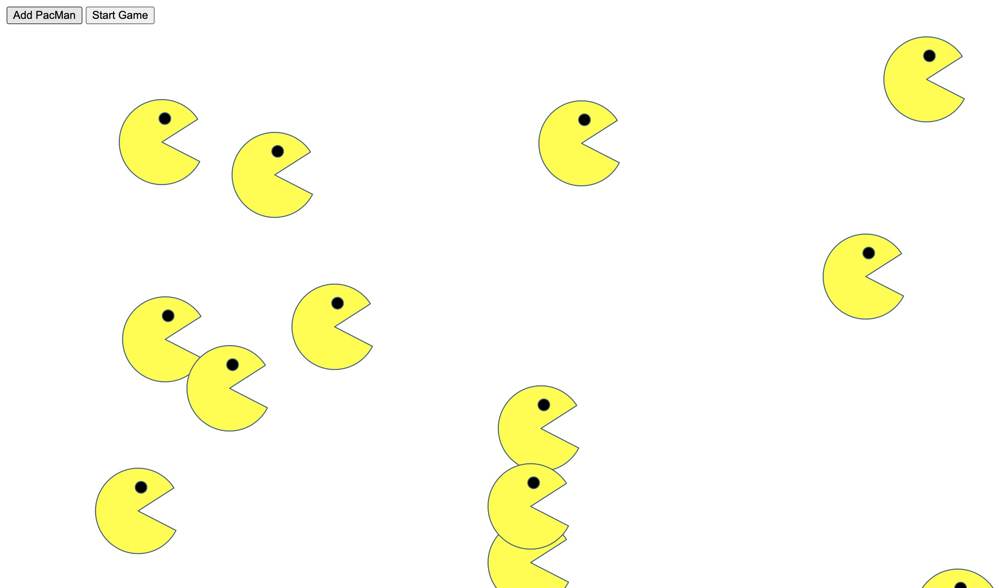

# PackMen Exercise

## Description

A PackMan generator that adds a PackMan headed in a random direction, with random velocity, to the web page. The PackMen take the walls, or boundaries, of the web page into consideration and bounce off of them.

## My PackMen Exercise

<a href="https://krjordan02.github.io/PacMen-Exercise/">PackMen Exercise</a>

## Installation 

Simply clone or download the project folder to your local machine and open the index.html file within your browser. 

## Future Improvements

Eventually the PackMen will react by running into each other.
